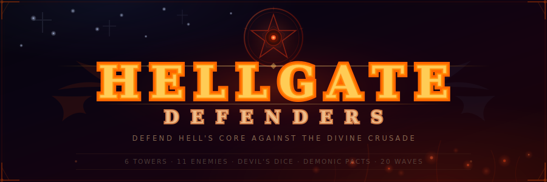
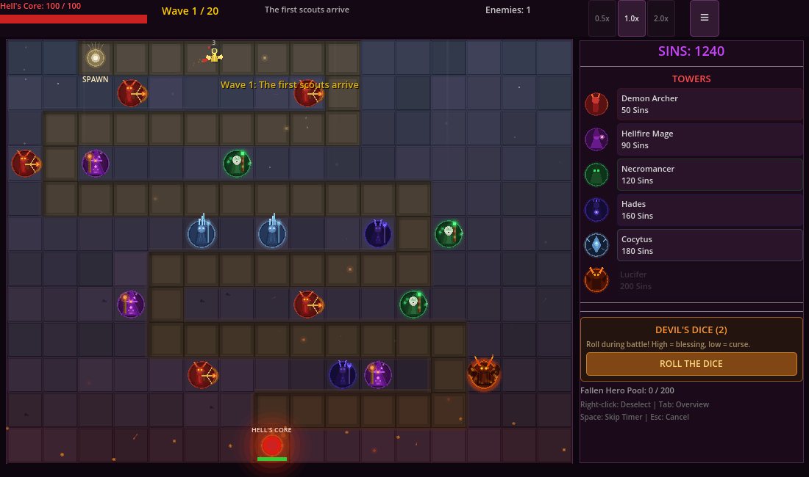

<p align="center">
  
</p>

<p align="center">
  <a href="https://godotengine.org/"></a>
  <a href="LICENSE"></a>
  
  
  
</p>

<p align="center">
  <b>A reverse-morality tower defense game where you defend Hell against Heaven's crusade.</b><br/>
  <i>Place demonic towers, earn Sins, roll the Devil's Dice, and make Demonic Pacts to survive 20 waves.</i>
</p>

---

<p align="center">
  
</p>

## What Makes It Different

- **You're the villain** — Defend Hell's Core against angels, paladins, and gods
- **Heaven-to-Hell battlefield** — Enemies march from a radiant heaven zone down into the fiery depths
- **High-stakes gambling** — Devil's Dice, Demonic Pacts, and Pandora's Relics create dramatic risk/reward moments
- **Enemy synergies** — Archangels buff allies, Michael shields everyone, Zeus disables your towers, Raphael heals nearby enemies
- **6 unique towers** — From fast Demon Archers to the global-pulse Lucifer, each fills an irreplaceable role
- **Procedural audio** — All sound effects and music generated at runtime, zero audio files
- **450+ automated tests** — Comprehensive test suite covering config, economy, combat, waves, and gambling

## Towers

| Tower | Cost | Role |
|:------|:-----|:-----|
| **Demon Archer** (ARC) | 50 | Fast single-target DPS, 1.8 atk/s |
| **Hellfire Mage** (MAG) | 90 | AoE swarm clearer, 60-radius blast |
| **Necromancer** (NEC) | 120 | 40% slow on hit, force multiplier |
| **Hades** (HAD) | 160 | Buffs nearby towers + periodic AoE damage |
| **Cocytus** (COC) | 180 | Ice spike beam, ramps damage on same target |
| **Lucifer** (LUC) | 200 | Global pulse hits ALL enemies on map (limit: 1) |

Each tower has 3 upgrade levels and 4 targeting modes (First / Last / Closest / Strongest). Sell for 65% refund.

## Enemies

| Enemy | HP | Threat |
|:------|:---|:-------|
| Angel Scout | 14 | Fast swarm unit |
| Holy Knight | 45 | Armored frontline |
| Divine Hunter | 28 | Speedster (130 speed) |
| Monk | 32 | Support unit |
| God of War | 110 | Heavy tank |
| Archangel Commander | 55 | Aura: +25% speed, -25% dmg taken for allies |
| Divine Guardian | 65 | Shield: enemies in first half of path are invulnerable |
| Archangel Raphael | 70 | Heals nearby enemies over time |
| Zeus | 80 | Lightning: disables 1-2 towers every 6s |
| **Paladin** (Boss) | 280 | Always drops a Pandora's Relic |
| **Archangel Michael** (Boss) | 200 | Shields all enemies (50% dmg reduction) |

Enemy HP and speed scale after wave 3. Waves feature increasing synergy combinations.

## Gambling Systems

**Devil's Dice** (press D) — Roll 1d6 during active waves. Waves 1-4 are safe; waves 5+ have 50/50 positive/negative outcomes. Rolling 6 kills all enemies; rolling 1 costs 15% of your Sins.

**Demonic Pacts** (every 5 waves) — Choose from 3 powerful benefit/cost tradeoffs. Blood Rage doubles damage but costs 20 Core HP. Demonic Fervor gives permanent +50% speed but reduces max HP by 25.

**Pandora's Relics** — Random loot drops: AoE bombs, sin caches, tower blessings, or dangerous traps.

## Controls

| Input | Action |
|:------|:-------|
| Left Click | Place tower / Select tower |
| Right Click | Cancel / Deselect |
| D | Roll Devil's Dice |
| Space / Enter | Skip between-wave timer |
| 1 / 2 / 3 | Speed: 0.5x / 1x / 2x |

---

## Play the Game

### Option 1: Run from Source

Requires [Godot 4.6+](https://godotengine.org/download) (standard build, not .NET).

```bash
git clone https://github.com/jiajie96/demongate.git
cd demongate
godot --path .
```

Or open the project in the Godot editor and press **F5**.

### Option 2: Export as Desktop App

1. Open the project in **Godot Editor**
2. Go to **Editor > Manage Export Templates > Download** (one-time setup)
3. Go to **Project > Export**
4. Click **Add...** and choose your platform (Windows, macOS, or Linux)
5. Click **Export Project** and choose a destination
6. Share the exported file — recipients don't need Godot installed

### Option 3: Web Build (play in browser)

Export as HTML5 so anyone can play from a link:

1. In Godot Editor: **Project > Export > Add... > Web**
2. Click **Export Project**, save to a folder (e.g., `docs/`)
3. You'll get `index.html` + supporting files

**Host on GitHub Pages:**

```bash
# After exporting to docs/ folder:
git add docs/
git commit -m "Add web export"
git push

# Then in GitHub repo: Settings > Pages > Source: "Deploy from branch"
# Set branch to main, folder to /docs
# Your game will be live at: https://jiajie96.github.io/demongate/
```

> **Note:** Godot 4.x web exports require `SharedArrayBuffer`, which needs specific HTTP headers (`Cross-Origin-Opener-Policy: same-origin` and `Cross-Origin-Embedder-Policy: require-corp`). GitHub Pages supports these by default. If hosting elsewhere, you may need to configure these headers.

**Host on itch.io** (easiest):

1. Create an account at [itch.io](https://itch.io)
2. Create a new project, set **Kind of project** to "HTML"
3. Upload the exported zip file
4. Check "This file will be played in the browser"
5. Publish — get a shareable link instantly

## Run Tests

```bash
cp project.godot project.godot.bak
sed 's|run/main_scene=.*|run/main_scene="res://tests/test_runner.tscn"|' project.godot.bak > project.godot
godot --headless --path . --quit
mv project.godot.bak project.godot
```

## Architecture

Three autoload singletons drive the game:

| Singleton | File | Role |
|:----------|:-----|:-----|
| **Config** | `game_config.gd` | Pure data: tower/enemy/wave stats, map path, gambling tables |
| **GM** | `game_manager.gd` | All mutable state: economy, combat, waves, effects |
| **Audio** | `audio_manager.gd` | Procedurally generated SFX and music (no audio files) |

Rendering: a single `Node2D` draws everything via `_draw()` each frame. All game entities are plain Dictionaries in Arrays — no custom classes or node hierarchies.

```
project.godot
scenes/
  main.tscn              # GameWorld (Node2D) + HUD (CanvasLayer)
scripts/
  autoload/
    game_config.gd       # Constants, tower/enemy/wave data, map path
    game_manager.gd      # Game state, combat, waves, gambling
    audio_manager.gd     # Procedural sound generation
    locale.gd            # i18n / translation
  game_world.gd          # 2D rendering + input handling
  hud.gd                 # Programmatic UI
tests/
  test_runner.gd         # 447 automated tests
```

## Design Deep Dive

For a detailed analysis of every design decision mapped to game design theory (MDA Framework, Flow Theory, Defender's Quest principles), see [GAME_DESIGN_ANALYSIS.md](GAME_DESIGN_ANALYSIS.md).

## License

[MIT](LICENSE)
