# Tower Visual Redesign Plan

Goal: wipe current tower avatars, re-pick KayKit character + weapons by attack spec so silhouette tells the role at a glance.

## Rules (final)

1. **One character + one weapon per tower, fixed across all 3 levels.** Lv1 looks identical to Lv3 — same model, same gear, same size, same color.
2. **Color is fixed per tower.** Signature hue identifies *which* tower.
3. **Level progression is shown entirely via attack VFX**, not the tower sprite. Higher level = slightly enhanced VFX, deliberately *not overwhelming*.
4. **All towers get a subtle breathing animation** (vertical bob + minor scale pulse) so they don't look like dead statues.

Signature colors:
- Bone Marksman — **original green/brown** (hunter cloak, no tint — tinting muddies the hood)
- Inferno Warlock — orange-fire `(1.0, 0.35, 0.15)`
- Soul Reaper — **original pale white** (wraith, no tint — the ghost look is unique on the field)
- Hades — royal purple `(0.5, 0.35, 1.0)`
- Cocytus — ice blue `(0.55, 0.88, 1.0)`
- Lucifer — hellfire crimson `(1.0, 0.25, 0.08)`

## Final tower visuals

| Tower | Render | Model | Weapon | Color |
|---|---|---|---|---|
| Bone Marksman | 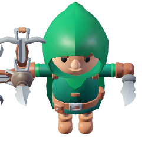 | `adv_rogue_hooded` | `adv_crossbow` | original |
| Inferno Warlock | 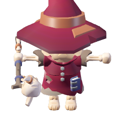 | `skeleton_mage` | `staff` | orange-fire |
| Soul Reaper |  | `skeleton_necromancer` | `scythe` | original (wraith-white) |
| Hades | 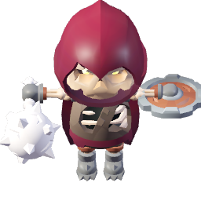 | `skeleton_rogue` | `mace` + `shield_small` | royal purple |
| Cocytus | 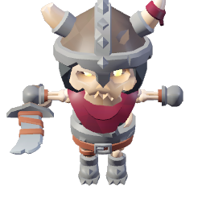 | `skeleton_warrior` | `blade` | ice blue |
| Lucifer | 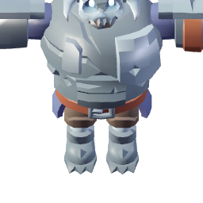 | `skeleton_golem` | `golem_axe` | hellfire crimson |

Every tower uses a unique model → silhouette-per-role rule holds. No level-up visual changes on the sprite itself.

## Level progression via attack VFX (the *only* way level shows)

Current VFX (Lv1 baseline) already wired in `particle_spawner.gd` — unchanged. Lv2/Lv3 add small, additive modifiers. "Not overwhelming" = tiny bumps, no screen-fill effects, no new colors that compete with neighbors.

| Tower | Lv1 (baseline, unchanged) | Lv2 adds | Lv3 adds |
|---|---|---|---|
| **Bone Marksman** | Crossbow bolt + muzzle flash + yellow hit spark | Bolt gets a short crimson trail (3-particle streak behind) | Hit spark doubles particle count; impact shows a brief "X" cross-slash mark |
| **Inferno Warlock** | Magenta AoE burst (18 magic + 12 stars) | AoE radius *indicator ring* flashes at impact (half-alpha) | Extra outer ring of 6 embers falls outward from blast edge |
| **Soul Reaper** | Standard hit spark + enemy green-tint slow | Faint scythe-arc slash draws over hit enemy (0.2s fade) | Arc gains a trailing green wisp; 2 small soul motes rise from hit |
| **Hades** | Upward motes at target tower + purple tendril beam | Tendril gains a single runic glyph midpoint (Unicode-style, 0.4s) | Second concurrent tendril paths through the air (thinner) |
| **Cocytus** | Ice shatter burst + falling blue shards | 2 extra shards on impact, slightly larger | Small frost crystal "blooms" on the enemy for 0.3s before shattering |
| **Lucifer** | Radial fire wave + per-enemy fire splash | Pulse center has a brief dark red flash (tile-sized only) | Each hit enemy also gets a single rising ember (0.4s life) |

None of these add new textures, new colors, or new systems — all reuse existing particle pools (`TEX_FIRE`, `TEX_SPARK`, `TEX_MAGIC`, `TEX_STAR`, `TEX_SPARK_ALT`). Implementation cost: ~4–8 lines per modifier in `particle_spawner.gd`, gated by `tower.level`.

## Breathing animation (applies to all towers)

**Problem:** pre-rendered sprites are one static frame per angle → towers look like dead statues between shots.

**Fix:** purely at the 2D draw step in `_draw_tower_model()` (scripts/game_world.gd:1471). No re-rendering, no extra viewports, no runtime 3D.

For each tower per frame:
- `bob_y = sin(GM.game_time * 1.6 + hash(tile)) * 0.8` → ±0.8 px vertical bob
- `scale_mod = 1.0 + sin(GM.game_time * 1.6 + hash(tile)) * 0.012` → ±1.2% scale pulse

The `hash(tile)` seed desynchronizes towers so they don't breathe in lockstep (would look robotic). 1.6 Hz ≈ 96 BPM — resting heart rate feel. Intentionally subtle — you notice it only on still attention, never when busy.

Suspended during `fire_flash > 0` so the existing recoil kick isn't diluted.

Implementation: ~5 lines added to `_draw_tower_model()`, applied to the `rect` before `draw_texture_rect`. Zero impact on VFX system.

## What I'd like you to confirm / veto

1. **All-towers single-model / single-weapon / single-color rule.** No per-level sprite changes.
2. **VFX level ladder** — the 12 small additions above. Flag any you want dropped or beefed up.
3. **Breathing params**: ±0.8 px bob, ±1.2% scale, 1.6 Hz, desynced by tile hash. Too subtle? Too much? Tell me the dial to turn.
4. **Keep Soul Reaper's original (wraith-white) palette** — my recommendation over the green tint.
5. **Bone Marksman shares silhouette with Swift Ranger enemy.** Accept, or swap Swift Ranger to the un-hooded `adv_rogue` to disambiguate?

All tower models come from `assets/models/kaykit/skeletons/` (demon side). Adventurer models stay reserved for enemies.

## Available demon characters

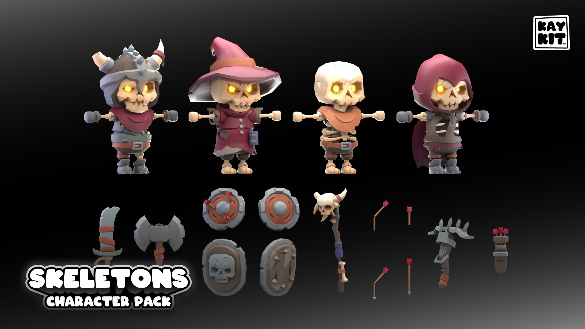

Roster (6 models):
- **Skeleton_Warrior** — horned helm, armored, shield-ready. Heavy silhouette.
- **Skeleton_Mage** — wide witch hat, robed. Classic caster.
- **Skeleton_Minion** — bare skull, tiny, hunched. Imp-like.
- **Skeleton_Rogue** — red hood + cloak. Agile silhouette.
- **Skeleton_Necromancer** — hooded dark-lord (downloaded, not in preview).
- **Skeleton_Golem** — oversized brute (downloaded, not in preview).

Weapons available: `axe`, `blade`, `crossbow`, `dagger`, `mace`, `mace_large`, `scythe`, `staff`, `quiver`, `shield_small`, `shield_large`, `golem_axe`, `golem_axe_large`.

## Tower specs recap

| Tower | Role | DMG | Range | ASPD | AoE | Notes |
|---|---|---|---|---|---|---|
| bone_marksman | Starter DPS | 2.0 | 120 | 1.8 | — | Fast single-target |
| inferno_warlock | Swarm clear | 3.0 | 100 | 0.8 | 60 | Fire AoE blast |
| soul_reaper | Slow on hit | 2.0 | 110 | 1.2 | — | 40% slow, force multiplier |
| hades | Support | 2.0 | 130 | passive | aura | Buffs nearby towers +50% |
| cocytus | Ramping beam | 8.0 | 140 | 0.4 | — | Ice, stacks on same target |
| lucifer | Global pulse | 3.0 | ∞ | 0.3 | all | Hits every enemy on map |

## Proposed mapping — archived drafts (outdated, kept for reference only)

> The sections below show earlier iterations where levels varied the weapon/shield. They are **superseded** by the "Final tower visuals" table above. Skim only if you want to compare against an earlier version.

### 1. Bone Marksman — `adv_rogue_hooded` (hooded hunter, per your request)
Fast single-target ranged DPS. Green hooded hunter silhouette reads "ranger" immediately. **Keep original colors** — the stock green hood + brown tunic + gold trim already looks great; tinting crimson-pink only tints the tunic (hood material ignores the override) and muddies the result.

Original colors (recommended):

| Lv1 | Lv2 | Lv3 |
|---|---|---|
|  | 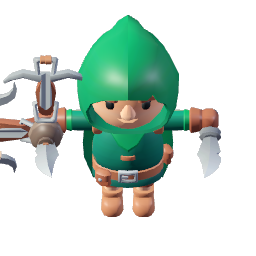 | 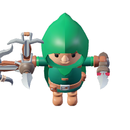 |

Tinted crimson-pink (shown for comparison — muddy):

| Lv1 | Lv2 | Lv3 |
|---|---|---|
| 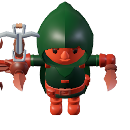 | 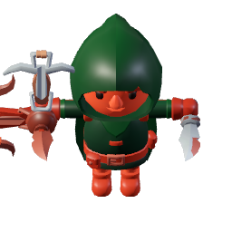 | 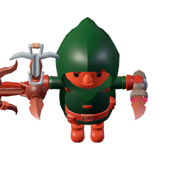 |

- **Lv1**: `adv_rogue_hooded` + `adv_crossbow`, scale 1.0
- **Lv2**: `adv_rogue_hooded` + `adv_crossbow` + `adv_dagger` offhand, scale 1.1
- **Lv3**: `adv_rogue_hooded` + `adv_crossbow` + `quiver` backpack, scale 1.2

**Trade-off noted**: `adv_rogue_hooded` is currently also used by the Swift Ranger enemy. Player may briefly confuse tower vs. enemy at a glance. Mitigate by (a) always rendering the tower with a red/pink tint on the bottom pedestal, or (b) swapping Swift Ranger onto `adv_rogue` (un-hooded). Flag if you want me to add that swap.

Why not dagger at Lv1: spec says 120 range — he must look like a shooter from the first frame.

### 2. Inferno Warlock — Skeleton_Mage (fire caster)
AoE fire blasts. Wide witch-hat silhouette = obvious caster. Progression: plain staff → flaming staff → soul-scythe (caster pivots to reaper staff).

| Lv1 | Lv2 | Lv3 |
|---|---|---|
| 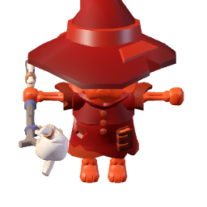 | 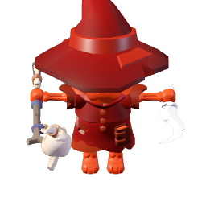 | 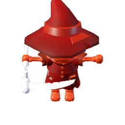 |

- **Lv1**: `skeleton_mage` + `staff`, scale 1.0
- **Lv2**: `skeleton_mage` + `staff` + `dagger` offhand (ritual blade), scale 1.1
- **Lv3**: `skeleton_mage` + `scythe` (soul-reaper staff upgrade), scale 1.2

Tint: orange-fire, fixed across levels.

> If you take **Option B** below for Soul Reaper, this tower moves to `skeleton_necromancer` instead — same progression path, hooded silhouette.

### 3. Soul Reaper — `skeleton_necromancer` (per your request, Hades displaced)

Hooded necromancer + scythe. Original colors are pale white/bone — very "wraith". Two palette options; pick one.

**Option A — Original colors (your preference):** regal ghost-wraith, reads as "ancient reaper".

| Lv1 | Lv2 | Lv3 |
|---|---|---|
| 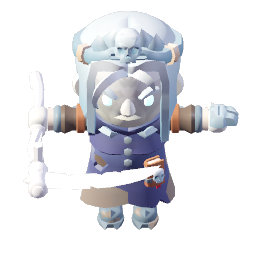 | 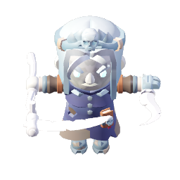 | 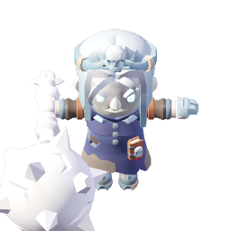 |

**Option B — Poison-green tint on same model:** more aggressive, visually distinct from any other tower.

| Lv1 | Lv2 | Lv3 |
|---|---|---|
| 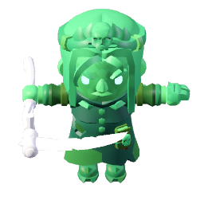 | 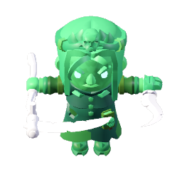 | 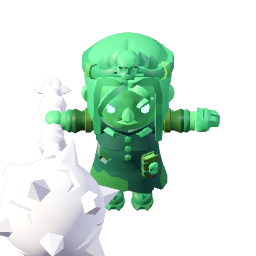 |

- **Lv1**: `skeleton_necromancer` + `scythe`, scale 1.0
- **Lv2**: `skeleton_necromancer` + `scythe` + `dagger` offhand, scale 1.1
- **Lv3**: `skeleton_necromancer` + `mace_large`, scale 1.2

My vote: **Option A (original colors)**. The white-wraith look is striking and unique on the battlefield; no other tower is pale. Green risks competing with the Hades-purple glow (they're adjacent cool/cold colors on the field).

### 4. Hades — `skeleton_rogue` (hooded dark lord, purple-tinted)

Since Soul Reaper claimed the Necromancer, Hades moves to `skeleton_rogue` tinted royal purple. Rogue's hood + cloak silhouette still reads as "hooded figure of authority"; mace + shield + purple tint sell "underworld king holding court".

| Lv1 | Lv2 | Lv3 |
|---|---|---|
| 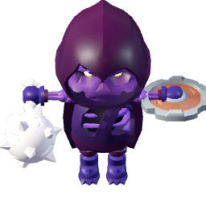 | 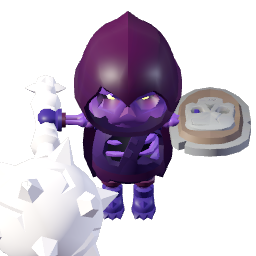 | 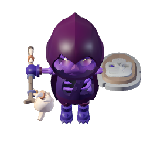 |

- **Lv1**: `skeleton_rogue` + `mace` + `shield_small`, scale 1.0
- **Lv2**: `skeleton_rogue` + `mace_large` + `shield_large`, scale 1.1
- **Lv3**: `skeleton_rogue` + `staff` + `shield_large`, scale 1.2

Tint: royal purple, fixed.

### 5. Cocytus — Skeleton_Warrior (frost knight)
Ramping ice beam, 8 dmg / 0.4 ASPD. Heaviest armored silhouette + ice-blue palette = "frost knight charging a beam". Weapon gets longer each tier (reach = charge).

| Lv1 | Lv2 | Lv3 |
|---|---|---|
| 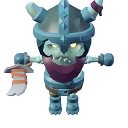 | 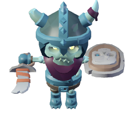 | 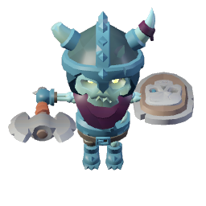 |

- **Lv1**: `skeleton_warrior` + `blade`, scale 1.0
- **Lv2**: `skeleton_warrior` + `blade` + `shield_large`, scale 1.1
- **Lv3**: `skeleton_warrior` + `axe` + `shield_large`, scale 1.2

Tint: ice blue, fixed.

### 6. Lucifer — Skeleton_Golem (fallen titan)
Global pulse, slow + massive. Only tower the player sees as *huge*. Axe size escalates.

| Lv1 | Lv2 | Lv3 |
|---|---|---|
| 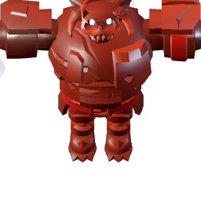 | 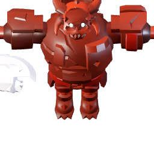 | 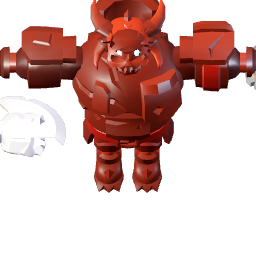 |

- **Lv1**: `skeleton_golem` + `golem_axe`, scale 1.5
- **Lv2**: `skeleton_golem` + `golem_axe_large`, scale 1.65
- **Lv3**: `skeleton_golem` + `golem_axe_large` + `shield_large`, scale 1.8

Tint: hellfire crimson, fixed.

## Characters NOT picked for towers

All 6 demon-side skeleton models are used 1:1 (one per tower). The 5 adventurer models below are already claimed by the holy-side enemies, so they are deliberately off-limits for towers — using one on a tower would break the demon-vs-holy visual contract. Listed here so you can veto the contract and tell me to pull one over.

| Model | Current enemy use | Visual |
|---|---|---|
| `adv_knight` | Crusader, Grand Paladin, Holy Sentinel, Archangel Michael | 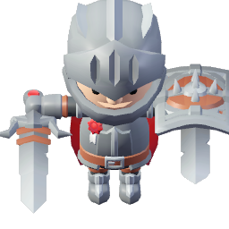 |
| `adv_barbarian` | War Titan, Archangel Marshal, Zeus | 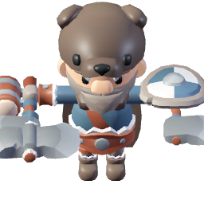 |
| `adv_rogue` | Seraph Scout | 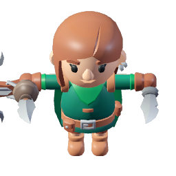 |
| `adv_rogue_hooded` | Swift Ranger | 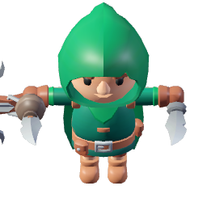 |
| `adv_mage` | Temple Cleric, Archangel Raphael | 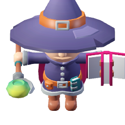 |

Also unused: individual weapon combos not chosen (e.g. `mace` on Rogue, `staff` on Warrior). Tell me if you want swaps.

---

*End of plan. The "Final tower visuals", "Level progression via attack VFX", and "Breathing animation" sections at the top are authoritative. Archived draft sections above are for reference only.*
